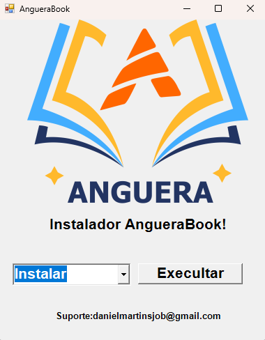
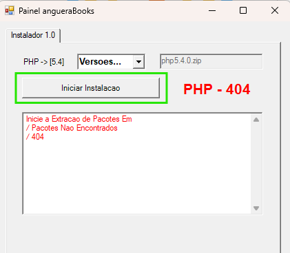
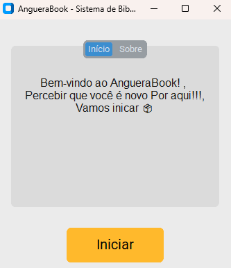
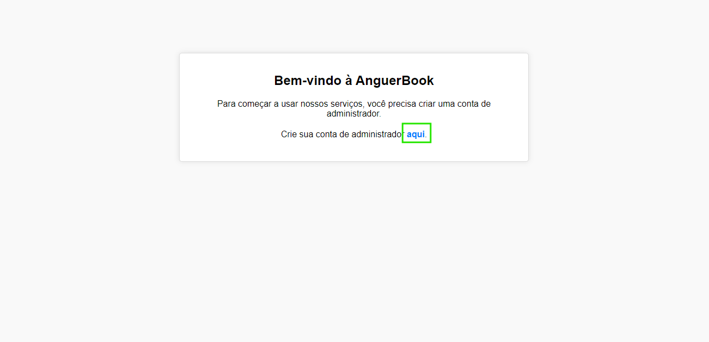
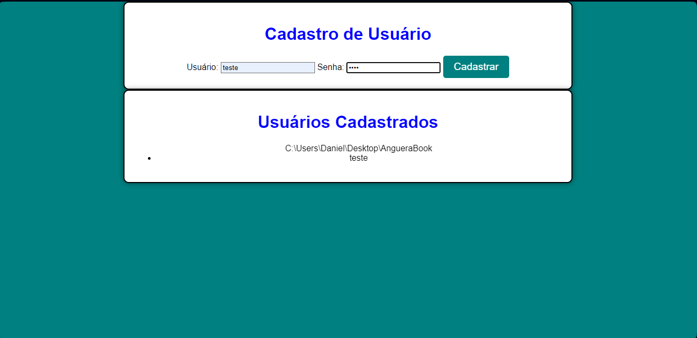
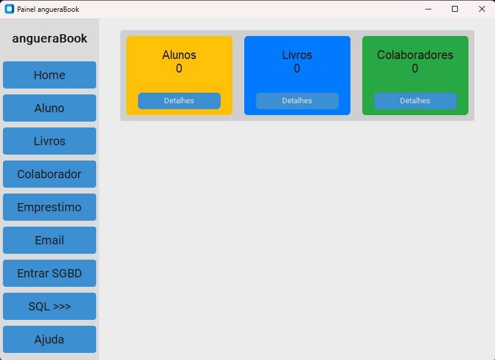
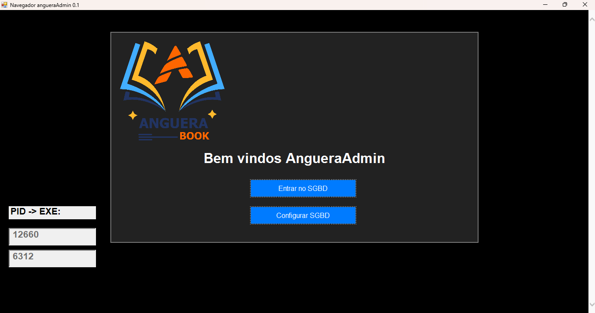
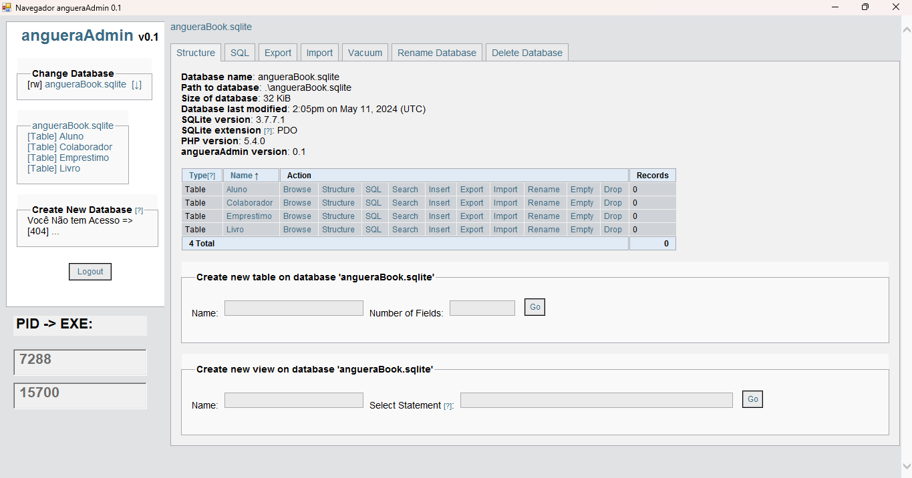

# AngueraBook 

<div style="display:flex;justify-content:center;">

</div>

> Sistem Para Bibliotecas, Envio de Emails, Automação 

### Ajustes e melhorias

O AngueraBook ainda está em desenvolvimento e as próximas atualizações serão voltadas nas seguintes tarefas:

- [x] Modo de Email
- [x] Exportação Base
- [x] Importação Base
- [x] Modo Codigo
- [x] Processamento / PID

### Funcionalidades 📦

>[!NOTE] 
O AngueraBook Está com Novas Funcionalidades:

- #### Alunos 🎓
    
    > Pesquisar,Adicionar,Importar,Email,Vizualizar

- #### Livros 📚
    
    > Pesquisar,Adicionar,Importar,Vizualizar


- #### Colaborador 🧑‍🏫
    
    > Pesquisar,Adicionar,Importar,Vizualizar,Email

- #### Administrador SGBD ✅
    
    > sistema de Administração AngueraAdmin


## 💻 Pré-requisitos

Antes de começar, verifique se você atendeu aos seguintes requisitos:

- Você tem uma máquina `Windows`.

## 🚀 (Instalador) AngueraBook

Para instalar o AngueraBook, siga estas etapas:


Windows:

```
> Click Install
```
- ⚠️ Importante, Baixe a Versão Empacotada para que Funcione no Modo Instalador 
> Link : https://github.com/dvizioon/SISTEMA-BIBLIOTECA/releases

<table>
  <tr>
    <td align="center">
      <a href="#" >
      
        <br>
        <sub>
          <b>Instalador</b>
        </sub>
      </a>
    </td>
    <td align="center">
      <a href="#" >
      
        <br>
        <sub>
          <b>Packages de PHP</b>
        </sub>
      </a>
    </td>
  </tr>
    <tr>
    <td align="center">
      <a href="#" >
      
        <br>
        <sub>
          <b>Inicio</b>
        </sub>
      </a>
    </td>
    <td align="center">
      <a href="#" >
      
        <br>
        <sub>
          <b>Login</b>
        </sub>
      </a>
    </td>
  </tr>
   <tr>
    <td align="center">
      <a href="#" >
      
        <br>
        <sub>
          <b>Criar Conta</b>
        </sub>
      </a>
    </td>
    <td align="center">
      <a href="#" >
      
        <br>
        <sub>
          <b>Secret</b>
        </sub>
      </a>
    </td>
  </tr>
  <tr>
    <td align="center">
      <a href="#" >
      
        <br>
        <sub>
          <b>Painel</b>
        </sub>
      </a>
    </td>
    <td align="center">
      <a href="#" >
      
        <br>
        <sub>
          <b>SGBD</b>
        </sub>
      </a>
    </td>
  </tr>
   <tr>
    <td align="center">
      <a href="#" >
      
        <br>
        <sub>
          <b>Painel SGBD</b>
        </sub>
      </a>
    </td>
  </tr>
</table>

```
> Depois Execulta o AngueraBook.exe
```

## 🚀 (Desenvolvedor) AngueraBook

Para instalar o AngueraBook no modo desenvolvedor , siga estas etapas:

python >= 3.8.0:

```
> python -m venv Python
```
- Você precisa Ativar a Venv para criar um
ambiente Controlado ✅

```
> pip -r Packages/Import/requirements.txt
```

```
> python main.py
```

Node >= 18.2.0:
```
> Yarn Install
```

```
> Yarn Start
```

## ☕ Usando PS1 AngueraBook

Para usar AngueraBook, siga estas etapas:

```
CMD > powershell.exe -WindowStyle Hidden -ExecutionPolicy Bypass -File "./Script/angueraWelcome.ps1"
```
## Compilar Pacote

```
CMD > pyinstaller main.py --onefile --noconsole --name angueraBook --add-data "App;App" --icon=Assets/lib.ico --collect-all=App   
```

## 🤝 Colaboradores

<table>
  <tr>
    <td align="center">
      <a href="#" >
        <br>
        <sub>
          <b>Daniel Estevão</b>
        </sub>
      </a>
    </td>
  
  </tr>
</table>

## 😄 Seja um dos contribuidores

Quer fazer parte desse projeto? Clique [AQUI](CONTRIBUTING.md) e leia como contribuir.

## 📝 Licença

Esse projeto está sob licença. Veja o arquivo [LICENÇA](LICENSE.md) para mais detalhes.
